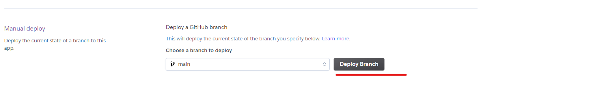

# HiStory Books Store
(Developer: Kamil Wojciechowski)

[Live webpage](https://hi-story-book-store-5899052efb65.herokuapp.com/)

## About 

HiStory Book Store - 5th Portfolio Project for Diploma in Full Stack Software Development with Code Institute. E-commerce history books store website built using Django.
Store specialized selling history books where passionates & proffessionals can find their next HiStory to read. 

## Table of Contents

- [HiStory Books Store](#history-books-store)
  - [About](#about)
  - [Table of Contents](#table-of-contents)
  - [Project Goals](#project-goals)
    - [User Goals](#user-goals)
    - [Business Owner Goals](#business-owner-goals)
  - [User Experience](#user-experience)
    - [Target Audience](#target-audience)
    - [User Requirements and Expectations](#user-requirements-and-expectations)
    - [User Stories](#user-stories)
      - [Users](#users)
      - [Site Owner](#site-owner)
    - [Agile Methodologies](#agile-methodologies)
  - [Design](#design)
    - [Design Choices](#design-choices)
    - [Colors](#colors)
    - [Fonts](#fonts)
    - [Structure](#structure)
    - [Wireframes](#wireframes)
  - [Database Diagram](#database-diagram)
  - [Messages and Interaction With Users](#messages-and-interaction-with-users)
  - [Admin Panel/Superuser](#admin-panelsuperuser)
  - [Technologies Used](#technologies-used)
    - [Languages](#languages)
    - [Libraries \& Frameworks](#libraries--frameworks)
    - [Django Packages](#django-packages)
  - [Features](#features)
  - [Validation](#validation)
    - [HTML Validation](#html-validation)
    - [CSS Validation](#css-validation)
    - [JavaScript Validation](#javascript-validation)
    - [PEP8 Validation](#pep8-validation)
  - [Accessibility](#accessibility)
  - [Performance](#performance)
  - [Device Testing](#device-testing)
  - [Browser compatibility](#browser-compatibility)
  - [Testing](#testing)
    - [Automated Testing](#automated-testing)
    - [Manual Testing](#manual-testing)
  - [Bugs](#bugs)
  - [Deployment](#deployment)
  - [Credits](#credits)
    - [Media](#media)
  - [Further Developments](#further-developments)
  - [Acknowledgements](#acknowledgements)

## Project Goals

### User Goals

### Business Owner Goals

[Back to Table Of Contents](#table-of-contents)

## User Experience

### Target Audience

[Back to Table Of Contents](#table-of-contents)

### User Requirements and Expectations

[Back to Table Of Contents](#table-of-contents)

### User Stories

#### Users

As a User I want to:

[Back to Table Of Contents](#table-of-contents)

#### Site Owner

As an Admin I want to:

[Back to Table Of Contents](#table-of-contents)

### Agile Methodologies

<a href="">Github Project</a>

<a href="">User Stories</a>

    
Kanban

    

[Back to Table Of Contents](#table-of-contents)

## Design

### Design Choices

### Colors

The main chosen color theme is white & purple (#505 & #FAFAFA). Purple color is often considered as a simbol of royalty as historically it used to be very scarce & expensive so only wealthy people of high status could afford it. Roles of kings & emperors are often associated with a general history so the main color pallete aimed to match the store's theme.

- #505 & #FAFAFA from <a href="https://favicon.io/favicon-generator/">Favicon</a>.

    
Contrast
 

- #EEEEFF from <a href="https://www.eggradients.com/shades-of-white">Eggradients</a>.

    
Contrast

- #30d5c from <a href="https://www.color-meanings.com/colors-that-go-with-purple/">Color Meanings</a>.

    
Contrast

- #FFF642 from <a href="https://coolors.co/contrast-checker/fff642-550055">Coolors</a>.

    
Contrast

- #0F3860 <a href="https://coolors.co/contrast-checker/0f3860-ffffff">Coolors</a>.

    
Contrast

[Back to Table Of Contents](#table-of-contents)

### Fonts

'Lato' - main font with sans-serif as its fallback font.

'Playfair Display' - h1 - h5 font with serif for fallback.

'Lato' font from <a href="https://fonts.google.com/specimen/Lato">Google Fonts</a>
'Playfair Display' font from <a href="https://fonts.google.com/specimen/Playfair+Display?query=playfair">Google Fonts</a>

[Back to Table Of Contents](#table-of-contents)

### Structure

T

### Wireframes

    
Desktop
 

[Back to Table Of Contents](#table-of-contents)

    
Tablet
 

[Back to Table Of Contents](#table-of-contents)

    
Mobile
 

[Back to Table Of Contents](#table-of-contents)

## Database Diagram

- Books:

Diagram:

Implemented models as per diagram:

## Messages and Interaction With Users

    
Messages updating the user on interactions status.
 

- Login

[Back to Table Of Contents](#table-of-contents)

## Admin Panel/Superuser

On Admin Panel, admin/ superuser has full access to CRUD functionality.

[Back to Table Of Contents](#table-of-contents)

## Technologies Used

- [GitHub](https://github.com/)
- [Codeanywhere](https://app.codeanywhere.com/)
- [Heroku](https://id.heroku.com/)
- [Lucidchart](https://lucid.app/)
- [Favicon](https://favicon.io/favicon-generator/)
- [Fontawesome](https://fontawesome.com/)
- [Google Fonts](https://fonts.google.com/?fbclid=IwAR0M5mybiiO6URy8GMzAKIYHRdX_lQHlJhwcmI6h-bNFuL90-osnCNZaC8Q)
- [Balsamiq](https://balsamiq.com/)
- [CI Python Linter](https://pep8ci.herokuapp.com/)
- [TinyPNG](https://tinypng.com/)
- [jQuery](https://jquery.com/)
- [WAVE](https://wave.webaim.org/)
- [amiresponsive?](https://ui.dev/amiresponsive?)

[Back to Table Of Contents](#table-of-contents)

### Languages

- HTML5
- CSS3
- JavaScript
- Python

[Back to Table Of Contents](#table-of-contents)

### Libraries & Frameworks

- [Django](https://www.djangoproject.com/)
- [Bootstrap](https://getbootstrap.com/)

[Back to Table Of Contents](#table-of-contents)

### Django Packages

- [Allauth](https://django-allauth.readthedocs.io/en/latest/installation.html)
- [Summernote](https://summernote.org/)

[Back to Table Of Contents](#table-of-contents)

## Features

Logo and Website Name

Navigation Bar

Footer

Register

Login

Password Reset

Password Change

About

[Back to Table Of Contents](#table-of-contents)

## Validation

### HTML Validation

    
To validate HTML of the website<a href="https://validator.w3.org/?fbclid=IwAR37NqVmxg37_tfuFOF4BJoyH8h_H-2n-Ed-64KJpoP1nEgLduNPO227mvE">the W3C Markup Validation Service</a> was used.

- home

[Back to Table Of Contents](#table-of-contents)

### CSS Validation

    
To validate style.css <a href="https://jigsaw.w3.org/css-validator/?fbclid=IwAR2zBUIZHTXAGa9KEvR__gsTkB05ZifTcd-us-pR0Kud0bLVaIPET-V-Hi4#validate_by_upload">the W3C Jigsaw CSS Validation Service</a> was used.

[Back to Table Of Contents](#table-of-contents)

### JavaScript Validation

<a href="https://jshint.com/">JSHint</a> JS Validation Serviced was used to validate the Javascript code for the website.

### PEP8 Validation

    
<a href="https://pep8ci.herokuapp.com">CI Python Linter</a> was used to perform the check if the code meets PEP8 requirements:

- urls.py

[Back to Table Of Contents](#table-of-contents)

## Accessibility

    
WAVE
 

[Back to Table Of Contents](#table-of-contents)

## Performance

    
Desktop
 

- home

    
Mobile
 

- home

- signup

- login

## Device Testing

List of devices used to test the website:

[Back to Table Of Contents](#table-of-contents)

## Browser compatibility

Following browsers were used to test the website:

[Back to Table Of Contents](#table-of-contents)

## Testing

### Automated Testing

Automated Testing

- stocklist.test_models.py

### Manual Testing

Manual Testing

---------------------------------------------------------------

Testing user stories:

| Feature | Action  | Expected Result | Actual Result |
| ------- | ------- | --------------- | ------------- |
| |  |  |  |

[Back to Table Of Contents](#table-of-contents)

## Bugs

| Bug  | Fix  |
| ------- | ------- |
| Books Images uploaded to the root directory | Add MEDIA_URL = '/media/' & MEDIA_ROOT = os.path.join(BASE_DIR, 'media') to settings.py |
| Webhook HTTP status code 500 for payment_intent.succeeded | review the code for typos & add import stripe |
| | |

[Back to Table Of Contents](#table-of-contents)

## Deployment

This site was deployed using Heroku in following steps:

Before deployment remember to set DEBUG = False & ensure requirements.txt is updated using terminal command: pip3 freeze --local requirements.txt

1. Log in to Heroku or create an account

2. On the main page click the button labelled New in the top right corner and from the drop-down menu select Create new app

3. You must enter a unique app name
4. Next select your region
5. Click on the Create App button

6. Go to the Settings tab
7. Click Reveal Config Vars and add a new record with the SECRET_KEY
8. Add another record to Config Vars with the CLOUDINARY_URL

9. Add another record to Config Vars with the DATABASE_URL

10. Add another record to Config Vars with PORT = 8000

11. Below Config Vars in Buildpacks select python

12. Go to the Deploy Tab
13. Choose Deployment method GitHub and click Save Changes
14. Confirm you want to connect to GitHub
15. Search for the repository name and click the connect button

16. Scroll to the bottom of the deploy page and select the preferred deployment type ( Automatic deploys or Manual deploy)

17. Choose a branch to deploy: main
18. Click on Deploy Branch button & wait until the app is successfully deployed/ address log errors

19. For Automatic deploys click on Enable Automatic Deploys button

[Back to Table Of Contents](#table-of-contents)

## Credits

- E-commerce store functionalities inspired by <a href="https://github.com/Code-Institute-Solutions/boutique_ado_v1">Code Institue's "Boutique Ado" Walkthrough Project</a>

- Parts of code based on <a href="https://github.com/Code-Institute-Solutions/boutique_ado_v1">Code Institue's "Boutique Ado" Walkthrough Project</a>

- JavaScript code to update quantity on click & move the screen back to the top of the books list from <a href="https://github.com/Code-Institute-Solutions/boutique_ado_v1">Code Institue's "Boutique Ado" Walkthrough Project</a>

- .overlay, .text-black, #payment-form, .form-control & #card-element & .loading-spinner CSS from <a href="https://github.com/Code-Institute-Solutions/boutique_ado_v1">Code Institue's "Boutique Ado" Walkthrough Project</a>

- Some elements of the checkout app from <a href="https://github.com/Code-Institute-Solutions/boutique_ado_v1">Code Institue's "Boutique Ado" Walkthrough Project</a>
  
- webhooks.py based on: <a href="https://stripe.com/docs/webhooks">Stripe</a>, <a href="https://github.com/Code-Institute-Solutions/boutique_ado_v1">Code Institue's "Boutique Ado" Walkthrough Project</a> & <a href="https://github.com/ArronBeale/CI_PP5_tee_time/blob/main/checkout/webhooks.py">Teetime</a>

- Parts of the code inspired by the knowledge from my Project Portfolio 4:<a href="https://github.com/WojtekKamilowski/CI_PP4_MPN">My Pantry Note</a>

- base.html accordingly updated & customized for this project based on <a href="https://github.com/Alan-Bushell/razor-sharp">'Razor Sharp'</a>
  
- object-fit for book images from <a href="https://stackoverflow.com/questions/61530120/how-to-make-the-images-same-fit-or-same-size">Stackoverflow</a>
  
- Dropright main-nav submenu for sorting by lowest & highest price based on <a href="https://getbootstrap.com/docs/4.6/components/dropdowns/">Bootstrap</a>

- Shadowed shopping cart with items in it from <a href="https://codersblock.com/blog/creating-glow-effects-with-css/">Codersblock</a>

### Media

- Favicon from <a href="https://favicon.io/favicon-generator/">Favicon</a>.
- Homepage background image from <a href="https://www.freepik.com/free-vector/background-with-sand-hourglass-glass-timer_22753059.htm#query=time%20glass&position=8&from_view=search&track=ais">Freepik</a>.
- Fonts pair found on <a href="https://www.fontpair.co/pairings/playfair-display-lato">Fontpair</a>
- 'Lato' font from <a href="https://fonts.google.com/specimen/Lato">Google Fonts</a>
- 'Playfair Display' font from <a href="https://fonts.google.com/specimen/Playfair+Display?query=playfair">Google Fonts</a>
- Ancient Europe book cover image from <a href="https://www.freepik.com/free-vector/vintage-roman-empire-poster-with-inscription-julius-caesar-coins-buildings-ancient-rome-civilization_9397964.htm#query=rome%20book%20cover&position=7&from_view=search&track=ais">Freepik</a>.
- Ancient ROW book cover image from <a href="https://www.freepik.com/free-vector/archaeology-cartoon-composition-with-set-digging-tool-icons-ancient-findings-grunge-board-with-text-illustration_21253335.htm#query=mezopotamy%20history%20book%20cover&position=26&from_view=search&track=ais">Freepik</a>.
- Medieval Europe book cover image from <a href="https://www.pexels.com/photo/black-steel-helmet-near-black-and-gray-handle-sword-161936/">Pexels</a>
- Medieval ROW book cover image from <a href="https://www.pexels.com/photo/young-mongolian-man-with-eagle-riding-horse-5275516/">Pexels</a>
- Reneissance Europe book cover image from <a href="https://www.pexels.com/photo/vitruvian-man-drawing-in-close-up-shot-12414385/">Pexels</a>
- Reneissance ROW book cover image from <a href="https://www.pexels.com/photo/great-wall-of-china-2412603/">Pexels</a>
- Early Industrial Revolution & Modern Era Europe book cover image from <a href="https://www.freeimages.com/photo/cotton-manufacturing-2424360">Freeimages</a> 
- Early Industrial Revolution & Modern Era ROW book cover image from <a href="https://www.pexels.com/photo/paper-map-of-australia-placed-on-wall-6564832/">Pexels</a>  
- XX Century Europe book cover image from <a href="https://pixabay.com/illustrations/microsoft-windows-window-to-dye-257885/">Pixabay</a>
- XX Century ROW book cover image from
- Early XXI Century Europe book cover image from <a href="https://www.freeimages.com/download/eu-polish-flags-636220">Freeimages</a>
- Early XXI Century ROW book cover image from <a href="https://pixabay.com/illustrations/bad-business-collage-crisis-19907/">Pixabay</a>

[Back to Table Of Contents](#table-of-contents)

## Further Developments

[Back to Table Of Contents](#table-of-contents)

## Acknowledgements
I would like to thank those who were a great support and inspiration during writing this project:
- My wife, who supported me during the process of creating this project.
- My mentor Mo Shami.
- Code Institute for preparing the materials and providing a wide range of available means of learning for the students.
