# HiStory Books Store
(Developer: Kamil Wojciechowski)

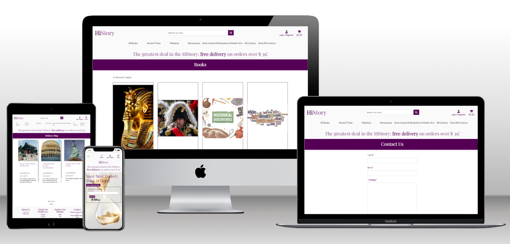

<a href="https://hi-story-book-store-5899052efb65.herokuapp.com/" target="_blank">LIVE WEBPAGE</a>

## About 

HiStory Book Store - 5th Portfolio Project for Diploma in Full Stack Software Development with Code Institute. E-commerce history books store website built using Django.
Store specialized selling history books where passionates & proffessionals can find their next HiStory to read. 

## Table of Contents

- [HiStory Books Store](#history-books-store)
  - [About](#about)
  - [Table of Contents](#table-of-contents)
  - [Business Model](#business-model)
    - [Purpose of the Application](#purpose-of-the-application)
    - [Core Business Intents](#core-business-intents)
    - [Marketing Strategies](#marketing-strategies)
  - [Marketing Techniques](#marketing-techniques)
    - [Social Media Platform](#social-media-platform)
    - [Newsletter Signup Form](#newsletter-signup-form)
  - [Project Goals](#project-goals)
    - [User Goals](#user-goals)
    - [Business Owner Goals](#business-owner-goals)
  - [User Experience](#user-experience)
    - [Target Audience](#target-audience)
    - [User Requirements and Expectations](#user-requirements-and-expectations)
    - [User Stories](#user-stories)
      - [Users](#users)
      - [Site Admin](#site-admin)
    - [Agile Methodologies](#agile-methodologies)
  - [Design](#design)
    - [Design Choices](#design-choices)
    - [Colors](#colors)
    - [Fonts](#fonts)
    - [Structure](#structure)
    - [Wireframes](#wireframes)
  - [Models Diagrams](#models-diagrams)
  - [Messages and Interaction With Users](#messages-and-interaction-with-users)
  - [Admin Panel/Superuser](#admin-panelsuperuser)
  - [Technologies Used](#technologies-used)
    - [Languages](#languages)
    - [Libraries \& Frameworks](#libraries--frameworks)
    - [Django Packages](#django-packages)
  - [Features](#features)
  - [Search Engine Optimization](#search-engine-optimization)
  - [Validation](#validation)
    - [HTML Validation](#html-validation)
    - [CSS Validation](#css-validation)
    - [JavaScript Validation](#javascript-validation)
    - [PEP8 Validation](#pep8-validation)
  - [Accessibility](#accessibility)
  - [Performance](#performance)
  - [Device Testing](#device-testing)
  - [Browser compatibility](#browser-compatibility)
  - [Testing](#testing)
    - [Automated Testing](#automated-testing)
    - [Manual Testing](#manual-testing)
  - [Bugs](#bugs)
  - [Deployment](#deployment)
  - [Credits](#credits)
    - [Media](#media)
  - [Further Developments](#further-developments)
  - [Acknowledgements](#acknowledgements)

## Business Model

### Purpose of the Application

The business is a B2C e-commerce platform with the main goal of selling tangible product: books listed online on the website.
The store is dedicated to sell history books so the primary customer the business targets are people interested in history, 
but also people who would like to start reading history books or maybe buy them as a gift for someone. 
The payment type employed is: SINGLE PAYMENT
The transaction is finished & delivery order is created once a single payment is made. 
The available payment option is payment by card, implemented using <a href="https://stripe.com/ie">Stripe</a>

### Core Business Intents

[Back to Table Of Contents](#table-of-contents)

### Marketing Strategies

The main marketing strategy is a mix of both online & offline marketing. 

The online marketing strategy campaign includes regular short posting on social media platform: Facebook, but also to be carried using the contact emails received via the newsletter form thanks to which regular newsletters can be sent to the subscribes informing them about important events, e.g. sales.

The offline marketing strategy is to engage with the users outside the web via the HiStory Book Club, a non-profit organization working to promote history as a hobby.

The strategy was chosen taking into account the store is a new business with limited budget so it must be done at a relatively low cost. Online marketing via Facebook is to be carried out by a staff member who is responsible for the Facebook page activities. 

Offline marketing is based on a non-profit activities that aim to make the brand present during subject-related events and visible for people who could potentially be looking to buy history books. During the events, the participants will be able to support the activities of the HiStory Club by contributing in a voluntary crowd-funding action to organize future events gathering history enthusiasts.

[Back to Table Of Contents](#table-of-contents)

## Marketing Techniques

### Social Media Platform

HiStory Books Store has its own page on Facebook. 
The content of posts is to address the memory of important history events or figures, often to be related to pieces of culture & pop-culture e.g. movies in historical theme. The goal is to encourage the followers to confront the content of those pieces of culture which picture a history event or figure with the knowledge that can be found in the literature. Sharing links to the blog posts posted on the websites blog. Interacting with the followers in the comments sections under the Facebook posts which would be aimed to drive constructive discussion feeding the algorithm to increase the popularity of the page amongst Facebook users.

<a href="https://www.facebook.com/profile.php?id=61550506871142">Facebook</a>

[Back to Table Of Contents](#table-of-contents)

### Newsletter Signup Form

HiStory Books Store uses Mailchimp to collect email addresses from users who would like to subscribe for store's newsletter. 
It is on purpose very simple, just enough that a user enters email address & click on the subscribe button. 
The newsletter content is to inform about sales or new books added to the store available on website.

[Back to Table Of Contents](#table-of-contents)

## Project Goals

### User Goals

- Purchase books(related user stories: 3, 4, 5, 8, 9, 10, 11)
- Find books offered for sale (related user stories: 3, 5, 6, 7)
- Get to known the details of books offered for sale (related user stories: 3, 4)
- Find information about the store (related user stories: 14)
- Use own account (related user stories: 1, 2)
- Easily navigate through the website (related user stories: 5, 6, 7, 12)
- Communicate with the website's administration (related user stories: 13)

### Business Owner Goals

- Keep the books offer up to date (related user stories: 15, 16, 17)
- Retain users on the website increasing the chance for sales(related user stories: 18, 20)
- Keep the users engaged to build customers relationship(related user stories: 17)

[Back to Table Of Contents](#table-of-contents)

## User Experience

### Target Audience

- people who are looking to buy history books
- people whose hobby is history
- people who would like to expand their knowledge of history
  
[Back to Table Of Contents](#table-of-contents)

### User Requirements and Expectations

- Accessible and responsive website.
- Intuitive website with a layout allowing to easily navigate through it.
- Easy access to Create, Read, Update & Delete functionalities.
- Links and features that function in accordance with their intended purpose.
- Connection with the community on the social media platforms.
- A contact form to contact the website owner.
- Adding to shopping cart.
- Updating shopping cart.
- Option to register and save delivery details.
- Secure checkout.

[Back to Table Of Contents](#table-of-contents)

### User Stories

- [User Stories on Github Issues](https://github.com/WojtekKamilowski/CI_PP5_HSBS/issues)

#### Users

As a User I want to:

1. Sign up so that I can login with my own account.
2. Login so that I can access my account profile.
3. View books list so that I can see what books the store sales.
4. View book details so that I can check if the book is one that I am looking for.
5. Search for a book so that I can find book I am looking for without checking the entire list.
6. Access categorized catalogue of books so that only books from a required category are displayed.
7. Sort books so that I see books sorted in a required order.
8. Add books to shopping cart so that I can have all books I wish to buy listed together.
9. Update the list of items in my shopping cart so that the correct list is ready for checkout.
10. Remove items from the shopping cart so that the shopping cart matches my final purchase decission.
11. Check-out so that I can finalize the purchase of my items.
12. See the list of all books offered paginated so that I can easier review the offer.
13. Contact site admins so that I can communicate feedback/complaints/suggestions.
14. Read about the website so that I know who offers me the products for sale.

[Back to Table Of Contents](#table-of-contents)

#### Site Admin

As an Admin I want to:

15. Add books to the store offer so that the store can sell online the new books available in the store.
16. Edit book details so that user can see books offered by the store with up to date details.
17. Delete books from the store's offer so that users cannot see books that are no longer available for sale.
18. Set up a custom 404 page so that users can be easily redirected to the books list from a non-existing page, increasing their offer viewing time and the likely-hood of buying a book.
19. Invite users to related non-profit group to engage outside the web so that it helps to build brand and supports the growth of regular customers base.
20. Offer users looking for more content a blog section so that they can access more engaging content related to the potential users' hobbies sot that they can be possibly retained longer on the website increasing the chance of making some extra purchase than originally intended by a user.
21. Collect email addresses from users who want to subscribe for newsletter so that I can use them for informing the subscribers about sales etc

[Back to Table Of Contents](#table-of-contents)

### Agile Methodologies

<a href="https://github.com/users/WojtekKamilowski/projects/4/views/1">Github Project</a>

<a href="https://github.com/WojtekKamilowski/CI_PP5_HSBS/issues">User Stories</a>

<a href="https://github.com/WojtekKamilowski/CI_PP5_HSBS/milestones?state=closed">Epics</a>

    
Kanban

    

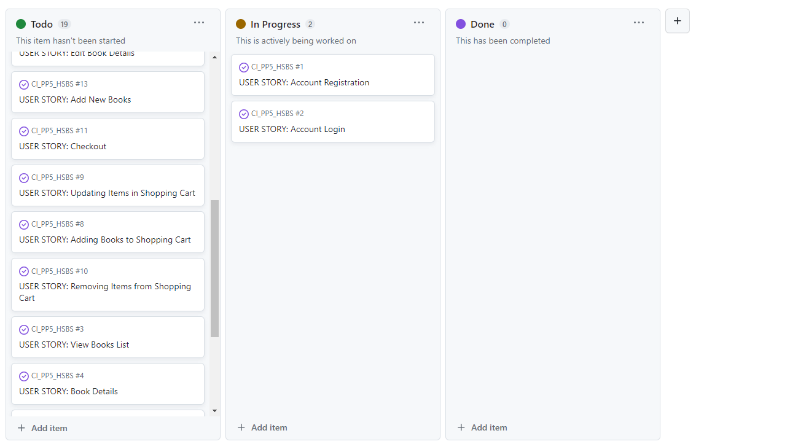

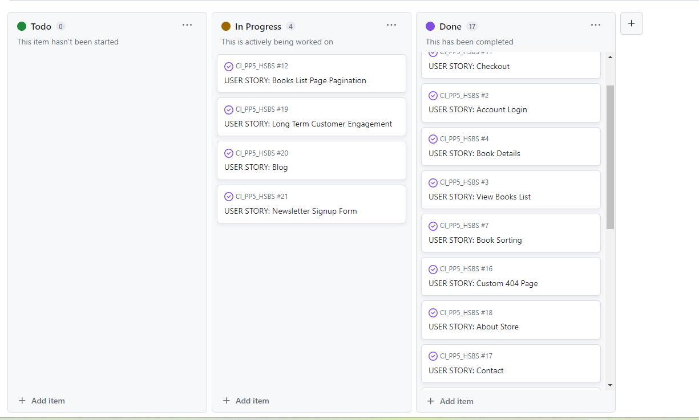

[Back to Table Of Contents](#table-of-contents)

## Design

### Design Choices

The main design choice was to create an open space feeling website with a contemporary approach towards the users.
The name HiStory was chosen to represent openness, welcoming them to shop on our website by simpy saying 'hi'. The store is dedicated for sales of books store which is why the standard category names were replaced by historical era times.

### Colors

The main chosen color theme is white & purple (#505 & #FAFAFA). Purple color is often considered as a simbol of royalty as historically it used to be very scarce & expensive so only wealthy people of high status could afford it. Roles of kings & emperors are often associated with a general history so the main color pallete aimed to match the store's theme.

- #505 & #FAFAFA from <a href="https://favicon.io/favicon-generator/">Favicon</a>.

    
Contrast
 

- #EEEEFF from <a href="https://www.eggradients.com/shades-of-white">Eggradients</a>.

    
Contrast

- #30d5c from <a href="https://www.color-meanings.com/colors-that-go-with-purple/">Color Meanings</a>.

- #FFF642 from <a href="https://coolors.co/contrast-checker/fff642-550055">Coolors</a>.

    
Contrast

- #0F3860 <a href="https://coolors.co/contrast-checker/0f3860-ffffff">Coolors</a>.

    
Contrast

- #294A08 <a hred="https://coolors.co/contrast-checker/294a08-ffffff">Coolors</a>.

    
Contrast

[Back to Table Of Contents](#table-of-contents)

### Fonts

'Lato' - main font with sans-serif as its fallback font.

'Playfair Display' - h1 - h5 font with serif for fallback.

'Lato' font from <a href="https://fonts.google.com/specimen/Lato">Google Fonts</a>
'Playfair Display' font from <a href="https://fonts.google.com/specimen/Playfair+Display?query=playfair">Google Fonts</a>

[Back to Table Of Contents](#table-of-contents)

### Structure

The website consists of seven django applications:

1. home
2. books
3. cart
4. checkout
5. profiles
6. contact
7. blog

The logo is the name of the website placed on the top left corner(desktop only), 
In the central part of the header there is a search input so users can easily start shopping, knowing more/less what they are looking for.
For users who are more interested to view the offer first and see what is available for sale there is a number of ways to view the full, sorted or categorized books list. Such structure is aimed to bring the users as quickly as possible to the offered products increasing the chance of making the purchase. 
User can categorize books list by:
1. Price - lowest or highest. In certain situations it is expected users may want to buy cheaper or more expensive books.
2. Rating - as default they appear from the higher rating as it is expected that users would be less likely to by books with lower ratings.
3. Oldest Times & Newest Times - it is expected that some users may be more interest to buy history books describing newer or older period of history.

[Back to Table Of Contents](#table-of-contents)

### Wireframes

    
Facebook Page
 

    
Desktop
 

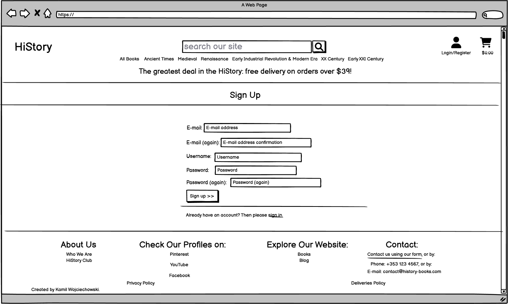

[Back to Table Of Contents](#table-of-contents)

    
Tablet
 

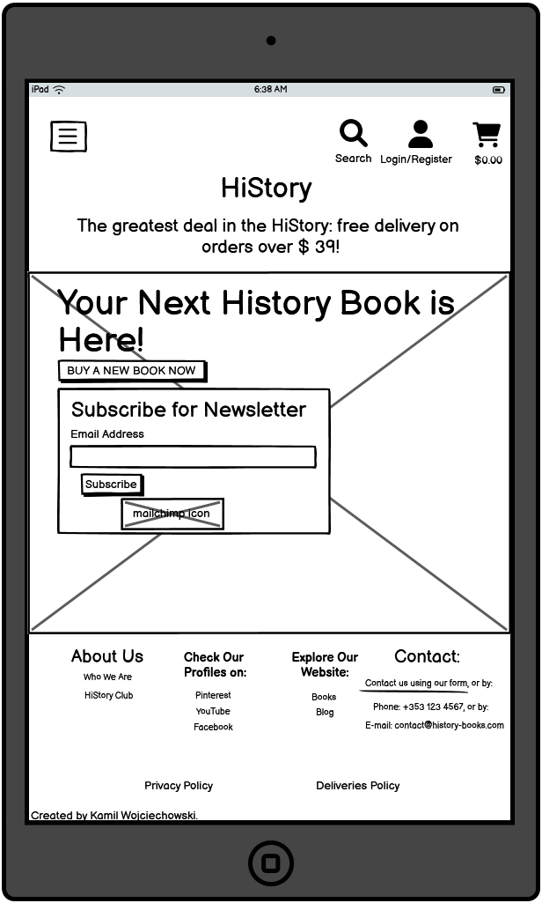
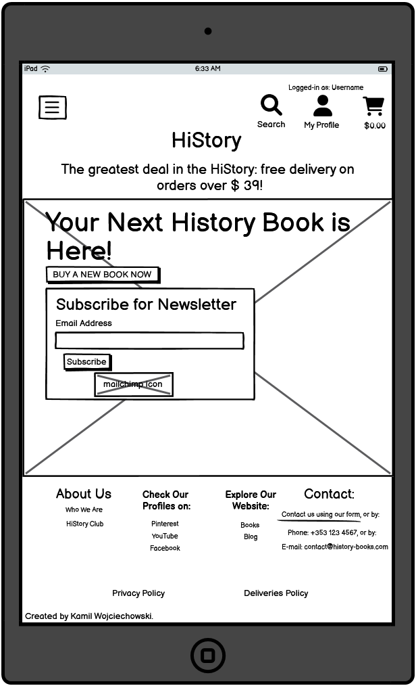
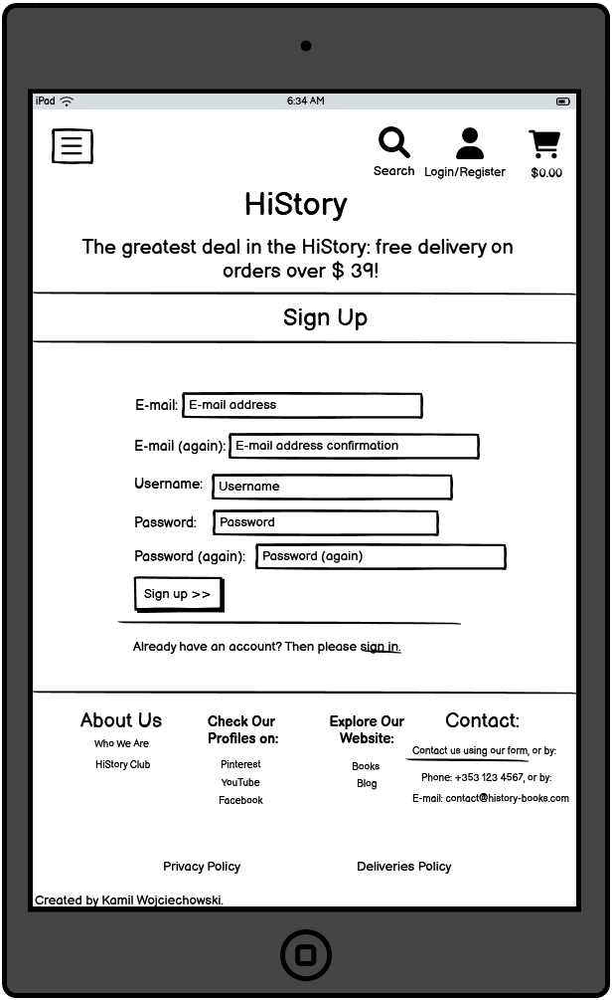
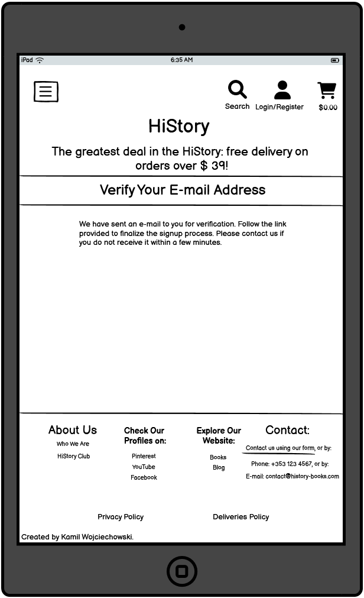
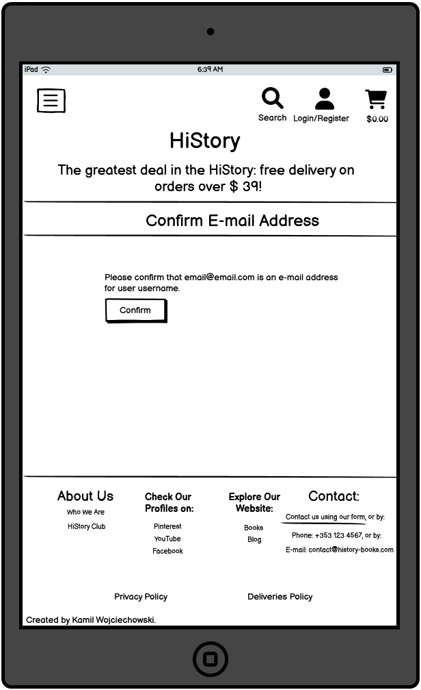

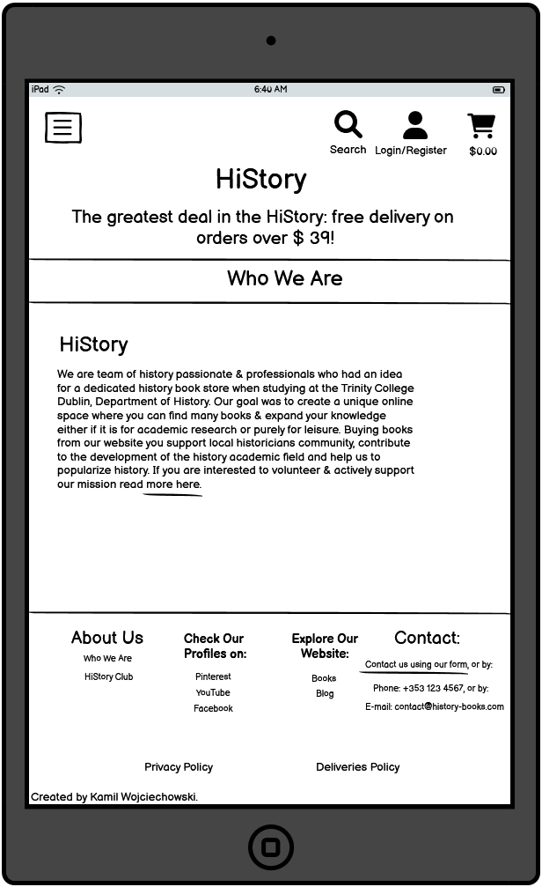
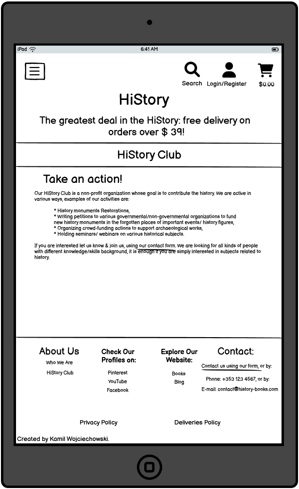
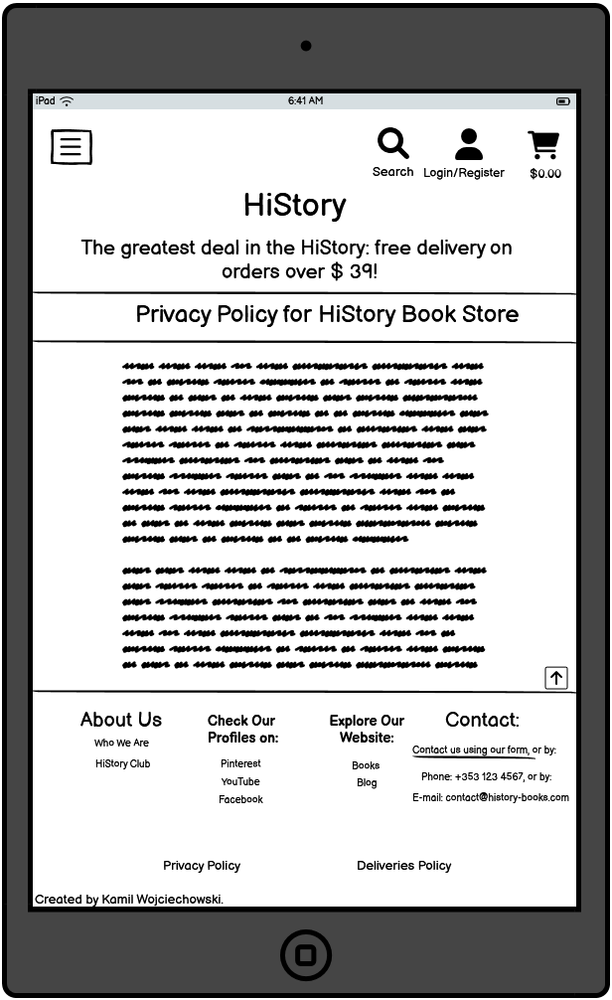

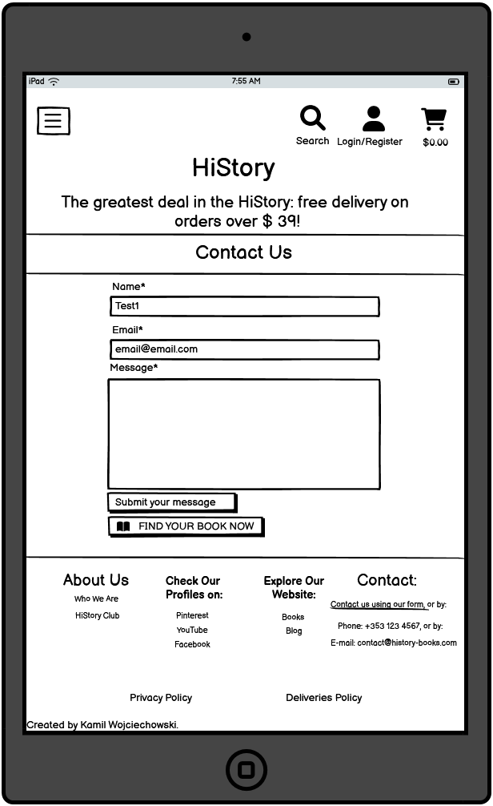
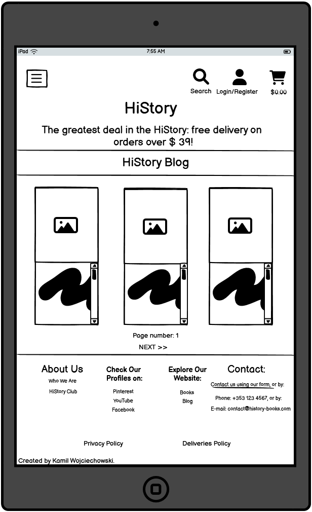
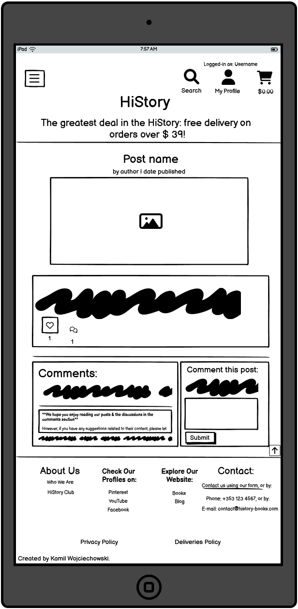

[Back to Table Of Contents](#table-of-contents)

    
Mobile
 

[Back to Table Of Contents](#table-of-contents)

## Models Diagrams

    
Books
 

Diagram:

Implemented models as per diagram:
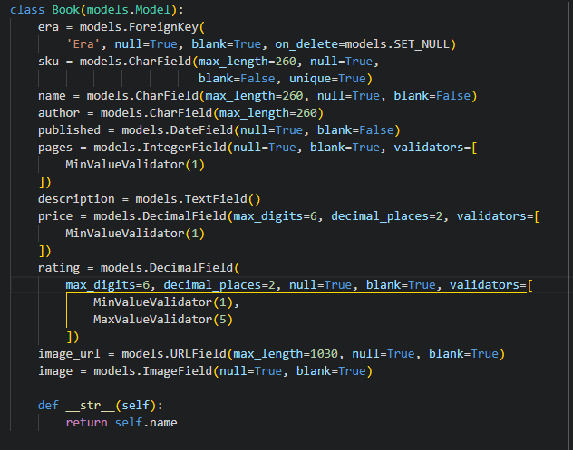

    
Checkout

Diagram:

Implemented models as per diagram:

    
Profiles

Diagram:

Implemented models as per diagram:

    
Contact

Diagram:

Implemented models as per diagram:

    
Blog

Diagram:

Implemented models as per diagram:

[Back to Table Of Contents](#table-of-contents)

## Messages and Interaction With Users

    
Messages updating the user on interactions status.
 

- Login

[Back to Table Of Contents](#table-of-contents)

## Admin Panel/Superuser

On Admin Panel, admin/ superuser has full access to CRUD functionality.

[Back to Table Of Contents](#table-of-contents)

## Technologies Used

- [GitHub](https://github.com/)
- [Codeanywhere](https://app.codeanywhere.com/)
- [Heroku](https://id.heroku.com/)
- [Lucidchart](https://lucid.app/)
- [Favicon](https://favicon.io/favicon-generator/)
- [Fontawesome](https://fontawesome.com/)
- [Google Fonts](https://fonts.google.com/?fbclid=IwAR0M5mybiiO6URy8GMzAKIYHRdX_lQHlJhwcmI6h-bNFuL90-osnCNZaC8Q)
- [Balsamiq](https://balsamiq.com/)
- [CI Python Linter](https://pep8ci.herokuapp.com/)
- [TinyPNG](https://tinypng.com/)
- [jQuery](https://jquery.com/)
- [WAVE](https://wave.webaim.org/)
- [TechSini](https://techsini.com/multi-mockup/index.php)
- [Ignore X-Frame headers](https://chrome.google.com/webstore/detail/ignore-x-frame-headers/gleekbfjekiniecknbkamfmkohkpodhe/related)
- [Privacy Policy Generator](https://www.privacypolicygenerator.info/download.php?lang=en&token=jIR86oYCsiIVTzYSP6sF8FlsimURJVCo#)
- [Stripe](https://stripe.com/ie)

[Back to Table Of Contents](#table-of-contents)

### Languages

- HTML5
- CSS3
- JavaScript
- Python

[Back to Table Of Contents](#table-of-contents)

### Libraries & Frameworks

- [Django](https://www.djangoproject.com/)
- [Bootstrap](https://getbootstrap.com/)

[Back to Table Of Contents](#table-of-contents)

### Django Packages

- [Allauth](https://django-allauth.readthedocs.io/en/latest/installation.html)
- [Summernote](https://summernote.org/)
- [django-crispy-forms](https://django-crispy-forms.readthedocs.io/en/latest/)
- [django-storages](https://django-storages.readthedocs.io/en/latest/)
- [django-countries](https://pypi.org/project/django-countries/)
- [django-phonenumber-field](https://django-phonenumber-field.readthedocs.io/en/latest/)*
  *Used for updating phone_number model in checkout.models.py, migrations made & migrated during tests & changed back to CharField to better suit the project needs.

[Back to Table Of Contents](#table-of-contents)

## Features

Header

It is included on all pages. Contains: website name that is clickable link to Home page which is a common feature on many websites so users expect it.
There is search queries form, navigation bar, Authentication & Cart icons.
Header is responsive: the website name, nav-bar and search queries form are not displayed for smaller screens.
Instead of the clickable website name there is Home link included in the drop-down burger menu which also contains the navigation links.
Search queries form is displayed after clicking the magnifying glass icon & the Authentication icon has shorter under-description.
User stories covered: 1, 2, 3, 4, 5, 6, 7.

Footer

It is included on all pages. It is divided in sections: About Us, Check Our Profiles on, Explore Our Website & Contact.
About Us included links to Who We Are & HiStory Club pages.
Check Our Profiles on with links to Pinterest, YouTube & Facebook.
Explore Our Website links to Books & Blog.
Contact with contact details and link to the contact page.
Footer is responsive: the sections are displayed verticaly for mobile screens.
User stories covered: 13, 14, 19, 20.

details>

Newsletter Signup Form

It is included on the home page.
Collects email addresses from users who want to subscribe for Newsletter.
It is responsive.
User stories covered: 21. 

Authentication

From Allauth.
Includes customised signup, signin, email confirmation & password reset pages that display on dektop, laptop, tablet & mobile screens as intended. 
User stories covered: 1, 2.

About

Included on the about.html
Describes the history of the founding of the store, convincing users why to shop from the store & includes a link to HiStory Club.
Displays on dektop, laptop, tablet & mobile screens as intended.
User stories covered: 14.

HiStory Club

Included on the club page. 
Describes the non-profit organization managed by the store owners & inviting users to join it by expressing their interest via the contact page.
Displays on dektop, laptop, tablet & mobile screens as intended.
User stories covered: 19.

Books

Implemented in the books application.
Displays a paginated All Books list. Allows users to search, sort & categorize by era the list of books.
Includes page with book details for each offered position. 
Site admins access books management section to add, delete & update the offered books on the store.
Feature is responsive & displays on dektop, laptop, tablet & mobile screens.
User stories covered: 3, 4, 5, 6, 7, 8, 12, 15, 16, 17.

Cart

Implemented in the cart application.
Shows list of items added to the shopping cart with all details to be reviews before checkout(price, quanitity etc.).
Feature is responsive & displays on dektop, laptop, tablet & mobile screens. on mobile screens the books image is hidden.
User stories covered: 8, 9, 10.

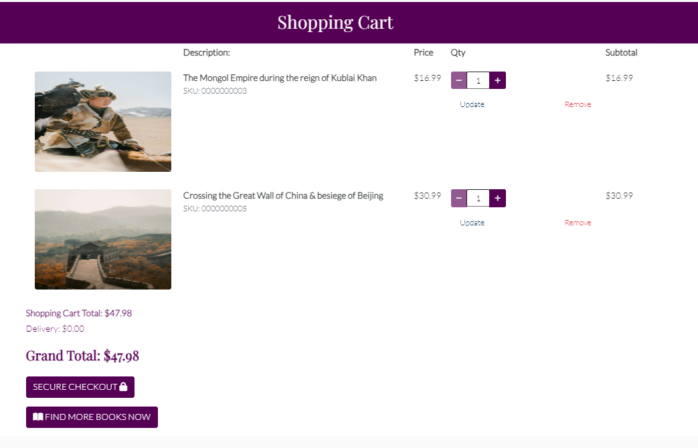

Checkout

Part of the checkout application.
Includes a form to collect delivery details and payment section built using <a href="https://stripe.com/ie">Stripe</a>.
There are <a href="https://stripe.com/docs/webhooks">Stripe Webhooks</a> in place. Order confirmation email are sent to the user after completing the checkout process.
Feature is responsive & displays on dektop, laptop, tablet & mobile screens. 
User stories covered: 11.

Profile

Implemented in the profiles application.
Includes a form to collect default delivery details and a table with order history.
Feature is responsive & displays on dektop, laptop, tablet & mobile screens. 
User stories covered: 2.

Contact

Implemented in the contact application.
Includes a form to collect name, email & contact message from the contacting user.
Feature is responsive & displays on dektop, laptop, tablet & mobile screens. 
User stories covered: 13.

Blog

Implemented in the blog application.
Contains a list of blog posts published by the site admins, where users can add comments & likes.
Users cannot edit or delete comments, also cannot undo likes without contactig the admins: please see [Further Developments](#further-development)
Feature is responsive & displays on dektop, laptop, tablet & mobile screens. 
User stories covered: 20.

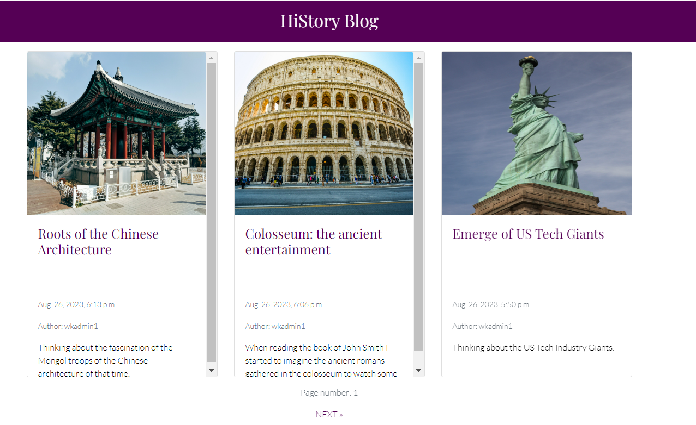

Customised 404 page

Code on the 404.html page
Contains error message displayed on a yellow colour background instantly informing user something is not right.
To maximise possibility of sales there is FIND YOUR BOOK NOW button linking to all books list
Feature is responsive & displays on dektop, laptop, tablet & mobile screens. 
User stories covered: 18.

[Back to Table Of Contents](#table-of-contents)

## Search Engine Optimization

## Validation

### HTML Validation

    
To validate HTML of the website<a href="https://validator.w3.org/?fbclid=IwAR37NqVmxg37_tfuFOF4BJoyH8h_H-2n-Ed-64KJpoP1nEgLduNPO227mvE">the W3C Markup Validation Service</a> was used.

- home

[Back to Table Of Contents](#table-of-contents)

### CSS Validation

    
To validate style.css <a href="https://jigsaw.w3.org/css-validator/?fbclid=IwAR2zBUIZHTXAGa9KEvR__gsTkB05ZifTcd-us-pR0Kud0bLVaIPET-V-Hi4#validate_by_upload">the W3C Jigsaw CSS Validation Service</a> was used.

[Back to Table Of Contents](#table-of-contents)

### JavaScript Validation

<a href="https://jshint.com/">JSHint</a> JS Validation Serviced was used to validate the Javascript code for the website.

### PEP8 Validation

    
<a href="https://pep8ci.herokuapp.com">CI Python Linter</a> was used to perform the check if the code meets PEP8 requirements:

- urls.py

[Back to Table Of Contents](#table-of-contents)

## Accessibility

    
WAVE
 

[Back to Table Of Contents](#table-of-contents)

## Performance

    
Desktop
 

- home

    
Mobile
 

- home

- signup

- login

## Device Testing

List of devices used to test the website:

- HP Pavilion 14
- Acer Nitro 5 without and with an external monitor (HP V22)
- Sony Xperia L2
- Motorola Moto G20

The website was also tested using Google Chrome Developer Tools, Toggle Device Toolbar simulating view from a few different listed devices, including popular amongst users iPad and iPhone 5.

[Back to Table Of Contents](#table-of-contents)

## Browser compatibility

Following browsers were used to test the website:

[Back to Table Of Contents](#table-of-contents)

## Testing

### Automated Testing

Automated Testing

- stocklist.test_models.py

### Manual Testing

Manual Testing

---------------------------------------------------------------

Testing user stories:

1. As a User I want to sign up so that I can login with my own account.

| Feature | Action  | Expected Result | Actual Result |
| ------- | ------- | --------------- | ------------- |
| Header | Click on Authentication icon, select Register option from the drop-down menu  | The sign up page is laoded | Works as expected |
| Sign Up | Fill up the form, click the sign up button, go to your e-mail inbox, click on the link from the email message, click on the confirm button  | Success message is displayed: You have confirmed emailaddress@email.com & the sign in page is loaded | Works as expected |

| Feature | Action  | Expected Result | Actual Result |
| ------- | ------- | --------------- | ------------- |
|  |  |  |  |

[Back to Table Of Contents](#table-of-contents)

## Bugs

| Bug  | Fix  |
| ------- | ------- |
| Books Images uploaded to the root directory | Add MEDIA_URL = '/media/' & MEDIA_ROOT = os.path.join(BASE_DIR, 'media') to settings.py |
| Webhook HTTP status code 500 for payment_intent.succeeded | review the code for typos & add import stripe |
| Item quantity form on the cart page does not responding as expected  | Review the code and add missig input attributes |
| Books Pagination not working for search queries, on era tabs & when sorting books list | update variables & remove pagination for search queries, on era tabs & when sorting books list as 'Page' object has no related attributes |
| 404 Custom Page not displayed 500 Error instead | delete views & url for the 404 error, keep 404.html |
| Post likes cannot be added, Extending the user model: SimpleLazyObject error | use the profile when you check/add/remove likes |
| IntegrityError when trying to post a comment | add  userprofile to request.user in comment_form.instance.username = request.user |

[Back to Table Of Contents](#table-of-contents)

## Deployment

This site was deployed using Heroku in following steps:

Before deployment remember to set DEBUG = False & ensure requirements.txt is updated using terminal command: pip3 freeze --local requirements.txt

1. Log in to Heroku or create an account

2. On the main page click the button labelled New in the top right corner and from the drop-down menu select Create new app

3. You must enter a unique app name
4. Next select your region
5. Click on the Create App button

6. Go to the Settings tab
7. Click Reveal Config Vars and add a new record with the SECRET_KEY
8. Add another record to Config Vars with the CLOUDINARY_URL

9. Add another record to Config Vars with the DATABASE_URL

10. Add another record to Config Vars with PORT = 8000

11. Below Config Vars in Buildpacks select python

12. Go to the Deploy Tab
13. Choose Deployment method GitHub and click Save Changes
14. Confirm you want to connect to GitHub
15. Search for the repository name and click the connect button

16. Scroll to the bottom of the deploy page and select the preferred deployment type ( Automatic deploys or Manual deploy)

17. Choose a branch to deploy: main
18. Click on Deploy Branch button & wait until the app is successfully deployed/ address log errors

19. For Automatic deploys click on Enable Automatic Deploys button

[Back to Table Of Contents](#table-of-contents)

## Credits

- E-commerce store functionalities inspired by <a href="https://github.com/Code-Institute-Solutions/boutique_ado_v1">Code Institue's "Boutique Ado" Walkthrough Project</a>

- Parts of code based on <a href="https://github.com/Code-Institute-Solutions/boutique_ado_v1">Code Institue's "Boutique Ado" Walkthrough Project</a>

- JavaScript code to update quantity on click & move the screen back to the top of the books list from <a href="https://github.com/Code-Institute-Solutions/boutique_ado_v1">Code Institue's "Boutique Ado" Walkthrough Project</a>

- .overlay, .text-black, #payment-form, .form-control & #card-element & .loading-spinner CSS from <a href="https://github.com/Code-Institute-Solutions/boutique_ado_v1">Code Institue's "Boutique Ado" Walkthrough Project</a>

- Some elements of the checkout app from <a href="https://github.com/Code-Institute-Solutions/boutique_ado_v1">Code Institue's "Boutique Ado" Walkthrough Project</a>
  
- webhooks.py based on: <a href="https://stripe.com/docs/webhooks">Stripe</a>, <a href="https://github.com/Code-Institute-Solutions/boutique_ado_v1">Code Institue's "Boutique Ado" Walkthrough Project</a> & <a href="https://github.com/ArronBeale/CI_PP5_tee_time/blob/main/checkout/webhooks.py">Teetime</a>

- aria_labels in profiles.forms.py based on <a href="https://github.com/ArronBeale/CI_PP5_tee_time/blob/main/profiles/forms.py">Teetime</a>

- checkout.froms.py widgets in OrderForm based on <a href="https://docs.djangoproject.com/en/4.2/ref/forms/widgets/">Django</a> & <a href="https://stackoverflow.com/questions/48822759/override-in-the-widget-attributes-the-max-length-set-on-the-model">Stackoverflow</a>, additionally part of code also from <a href="https://stackoverflow.com/questions/17165147/how-can-i-make-a-django-form-field-contain-only-alphanumeric-characters">Stackoverflow</a>

- Books List pagination from YouTube by <a href="https://www.youtube.com/watch?v=N-PB-HMFmdo">Codemy.com</a>

- Parts of the code inspired by the knowledge from my Project Portfolio 4:<a href="https://github.com/WojtekKamilowski/CI_PP4_MPN">My Pantry Note</a>

- base.html inspired by <a href="https://github.com/Alan-Bushell/razor-sharp">'Razor Sharp'</a>

- Parts of blog app inspired by <a href="https://github.com/Alan-Bushell/razor-sharp/tree/main/blog">'Razor Sharp'</a> 
  
- object-fit for book images from <a href="https://stackoverflow.com/questions/61530120/how-to-make-the-images-same-fit-or-same-size">Stackoverflow</a>
  
- Dropright main-nav submenu for sorting by lowest & highest price based on <a href="https://getbootstrap.com/docs/4.6/components/dropdowns/">Bootstrap</a>

- Shadowed shopping cart with items in it from <a href="https://codersblock.com/blog/creating-glow-effects-with-css/">Codersblock</a>

- Post likes bug fix from <a href="https://stackoverflow.com/questions/44458764/extending-the-user-model-simplelazyobject-error-when-using-user-is-authenticate">Stackoverflow</a>

- Adding comments bug fix from <a href="https://stackoverflow.com/questions/71892594/integrityerror-exception-value-with-db-relations-in-django-on-form-submission">Stackoverflow</a>

- Update timezone from <a href="https://stackoverflow.com/questions/29311354/how-to-set-the-timezone-in-django">Stackoverflow</a>

### Media

- Favicon from <a href="https://favicon.io/favicon-generator/">Favicon</a>.
- Homepage background image from <a href="https://www.freepik.com/free-vector/background-with-sand-hourglass-glass-timer_22753059.htm#query=time%20glass&position=8&from_view=search&track=ais">Freepik</a>.
- Fonts pair found on <a href="https://www.fontpair.co/pairings/playfair-display-lato">Fontpair</a>
- 'Lato' font from <a href="https://fonts.google.com/specimen/Lato">Google Fonts</a>
- 'Playfair Display' font from <a href="https://fonts.google.com/specimen/Playfair+Display?query=playfair">Google Fonts</a>
- Ancient Europe book cover image from <a href="https://www.freepik.com/free-vector/vintage-roman-empire-poster-with-inscription-julius-caesar-coins-buildings-ancient-rome-civilization_9397964.htm#query=rome%20book%20cover&position=7&from_view=search&track=ais">Freepik</a>.
- Ancient ROW book cover image from <a href="https://www.freepik.com/free-vector/archaeology-cartoon-composition-with-set-digging-tool-icons-ancient-findings-grunge-board-with-text-illustration_21253335.htm#query=mezopotamy%20history%20book%20cover&position=26&from_view=search&track=ais">Freepik</a>.
- Medieval Europe book cover image from <a href="https://www.pexels.com/photo/black-steel-helmet-near-black-and-gray-handle-sword-161936/">Pexels</a>
- Medieval ROW book cover image from <a href="https://www.pexels.com/photo/young-mongolian-man-with-eagle-riding-horse-5275516/">Pexels</a>
- Reneissance Europe book cover image from <a href="https://www.pexels.com/photo/vitruvian-man-drawing-in-close-up-shot-12414385/">Pexels</a>
- Reneissance ROW book cover image from <a href="https://www.pexels.com/photo/great-wall-of-china-2412603/">Pexels</a>
- Early Industrial Revolution & Modern Era Europe book cover image from <a href="https://www.freeimages.com/photo/cotton-manufacturing-2424360">Freeimages</a> 
- Early Industrial Revolution & Modern Era ROW book cover image from <a href="https://www.pexels.com/photo/paper-map-of-australia-placed-on-wall-6564832/">Pexels</a>  
- XX Century Europe book cover image from <a href="https://pixabay.com/illustrations/microsoft-windows-window-to-dye-257885/">Pixabay</a>
- XX Century ROW book cover image from
- Early XXI Century Europe book cover image from <a href="https://www.freeimages.com/download/eu-polish-flags-636220">Freeimages</a>
- Early XXI Century ROW book cover image from <a href="https://pixabay.com/illustrations/bad-business-collage-crisis-19907/">Pixabay</a>
- Image for egyptian blog post <a href="https://www.pexels.com/photo/egyptian-symbols-3199399/">Pexels</a>
- Facebook cover photo <a href="https://www.pexels.com/photo/closeup-photography-of-book-page-folding-forming-heart-1083633/">Pexels</a>
- Image for US blog post <a href="https://www.pexels.com/photo/the-statue-of-liberty-69205/">Pexels</a>
- Image for Roman blog post <a href="https://www.pexels.com/photo/administration-ancient-arches-architecture-356966/">Pexels</a>
- Image for China blog post <a href="https://www.pexels.com/photo/gazebo-near-trees-during-day-3018977/">Pexels</a>

[Back to Table Of Contents](#table-of-contents)

## Further Developments

- Add pagination feature for search queries, on era tabs & when sorting books list. Possibly by starting with fixing error: 'Page' object has no attribute 'ordered'
initial solutions research started on <a href="https://stackoverflow.com/questions/22426502/page-object-has-no-attribute-ordered-exception">Stackoverflow</a>

- Add functionalities to add,update & delete blog posts from the website without using django admin by superusers.
  
- Add functionalities to add,update & delete all users'post comments from the website without using django admin by superusers.
  
- Add functionalities to add,update & delete user's own post comments.

- Undo post like when clicking on the like icon.
  
- Add additional product app where the items listed for sale would be related to the book store(complementary sales), however with different details than books usually have, for example bookmarks or reading torches, HiStory t-shirts and other gadgets etc.
  
- Expand books app to include books in a digital form such audio-books & e-books.

- Add more payment options, e.g. Paypal.

- Add books rating system available for users with admins confirmation.
  
- Visualize rating with proportionally filling stars.

- Add settings option for users profile.

[Back to Table Of Contents](#table-of-contents)

## Acknowledgements
I would like to thank those who were a great support and inspiration during writing this project:
- My wife, who supported me during the process of creating this project.
- My mentor Mo Shami.
- Code Institute for preparing the materials and providing a wide range of available means of learning for the students.
